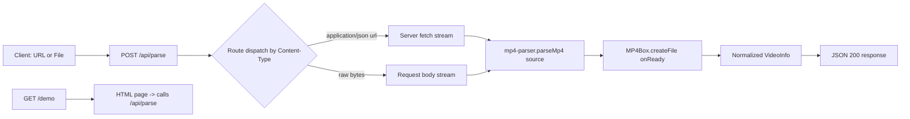

## User Requirements
Build an API service that parses MP4 video files using the `mp4box.js` library. A user submits either a video URL or the raw MP4 file bytes, and the API returns structured video metadata.

## Product Overview
A Cloudflare Workers (Express-on-Workers) HTTP API that accepts an MP4 and returns its technical info. Two input modes are supported in a single endpoint:
- **URL mode**: `POST /api/parse` with JSON body `{ "url": "https://..." }`; the server fetches and streams the video.
- **File mode**: `POST /api/parse` with the raw MP4 bytes as the request body (`Content-Type: video/mp4` or `application/octet-stream`).
Results are returned inline per request (no database persistence). A small in-browser demo page is served for manual testing.

## Core Features
- `POST /api/parse` accepts a URL (`{url}`) or raw MP4 binary body and returns parsed video info.
- Streaming parse via `mp4box.js` that stops as soon as the `moov` atom is found (works for faststart and non-faststart files).
- Normalized response: duration, brands, QuickTime flag, overall bitrate, and per-track info (type, codec, width/height, bitrate, timescale, sample count, language).
- Clear error handling for missing URL, unreachable URL, unsupported/non-MP4 input, and oversized streams.
- `GET /demo` serves a self-contained HTML page with a URL box and file picker to test the API in-browser.


## Tech Stack Selection
- **Runtime**: Cloudflare Workers (existing `express-d1-app`, `main: src/index.ts`, `compatibility_flags: ["nodejs_compat"]`).
- **Web framework**: Express 5 via `cloudflare:node` `httpServerHandler` (existing pattern, unchanged).
- **Parser**: `mp4box` npm package (the JS port of GPAC MP4Box).
- **Language**: TypeScript (existing `tsconfig.json`, strict, Bundler resolution).
- **Testing**: Vitest with `@cloudflare/vitest-plugin` (existing `test/index.spec.ts`, `vitest.config.mts`).
- No new Wrangler bindings or D1 tables are required (no persistence).

## Implementation Approach
The feature is built as a thin Express route that feeds an MP4 byte stream into `mp4box.js`. `MP4Box.createFile()` returns an `ISOFile`; we register `onReady` (fires once the `moov` atom is parsed) and `onError` callbacks, then stream chunks via `appendBuffer(buffer)` where each buffer carries a `fileStart` offset. Because `onReady` fires as soon as `moov` is available, we stop streaming immediately — this is the key optimization that keeps memory at one-chunk-at-a-time and bounds CPU time even for large or non-faststart files.

**Key decisions:**
- **Streaming, not full-buffer**: Avoids the 128MB Worker memory ceiling and large request-body limits; we never hold the whole file.
- **Single endpoint, content-type dispatch**: JSON `{url}` → server-side `fetch` + stream; otherwise treat the body as raw MP4 bytes (`express.json()` only parses `application/json`, so binary bodies remain a live readable stream).
- **`maxBytes` cap (~100MB)**: guards against pathological streams with no `moov`; returns a clear error instead of hanging/OOM.
- **Pure parser module** (`parseMp4(source)`) decoupled from Express, so it is unit-testable and reusable; route layer only does I/O and normalization of errors.

**Performance & reliability:** Time/space complexity is O(n) over bytes until `moov` (often a small prefix). Bottleneck is network/CPU for non-faststart large files; mitigated by early-stop + byte cap. Errors from `fetch` (non-OK, missing body) and mp4box (`onError`, stream-ended-without-moov) are caught and mapped to JSON error responses with appropriate HTTP status.

## Implementation Notes
- **Reuse existing patterns**: Keep the flat `src/` layout and the existing `app.listen(3000)` / `export default httpServerHandler({ port: 3000 })` export. Do not touch `/api/members` or `members_db`.
- **Raw body handling**: Do NOT add a JSON/body parser for binary. Rely on `express.json()` only consuming `application/json`; the binary `req` (Node `IncomingMessage`, async-iterable of `Buffer`) is fed directly to the parser.
- **mp4box import risk (verify first)**: The `mp4box` entry is UMD and may reference browser/Node globals. Run a `wrangler dev` smoke test immediately after adding the dependency. If the import fails under `nodejs_compat`, fall back to importing the ESM/browser build (`mp4box/dist/mp4box.all.js`) or wrap with a minimal shim; document the working import in the parser file.
- **Type declarations**: No official `@types/mp4box` exists; add a minimal `src/types/mp4box.d.ts` module declaration to keep `tsc`/`vitest` clean.
- **Blast radius**: All changes are additive (new route, new files); no modifications to existing endpoints, configs, or schemas.

## Architecture Design


## Directory Structure Summary
Flat additions following the existing project layout, plus a parser module and a demo module.

```
express-d1-app/
├── package.json                 # [MODIFY] Add "mp4box" dependency; keep scripts/tests intact.
├── src/
│   ├── index.ts                 # [MODIFY] Register POST /api/parse (URL + raw body) and GET /demo; import new modules. Keep existing members routes.
│   ├── mp4-parser.ts            # [NEW] Core streaming parser. Exposes parseMp4(source, opts) returning normalized VideoInfo. Handles onReady/onError, chunk offset tracking, early-stop, maxBytes cap.
│   ├── demo.ts                  # [NEW] Exports an HTML string for the demo page (URL box + file picker + results panel) that POSTs to /api/parse.
│   └── types/
│       └── mp4box.d.ts          # [NEW] Minimal `declare module "mp4box"` with MP4Box.createFile, onReady/onError, and ISOFile/info types.
└── test/
    ├── parse.spec.ts            # [NEW] Vitest tests: 400 on missing url, 502 on bad url, happy path with fixture (URL + raw body), error on non-MP4.
    └── fixtures/
        └── sample.mp4           # [NEW] Tiny valid MP4 fixture (~few KB) for tests (committed binary).
```

## Key Code Structures
```ts
// src/mp4-parser.ts
export interface TrackInfo {
  id: number;
  type: "video" | "audio" | "text" | "metadata" | string;
  codec: string;
  width?: number;
  height?: number;
  bitrate?: number;
  timescale?: number;
  nb_samples?: number;
  language?: string;
}

export interface VideoInfo {
  duration: number;          // seconds
  brands: string[];
  isQuickTime: boolean;
  overallBitrate?: number;
  tracks: TrackInfo[];
}

export async function parseMp4(
  source: AsyncIterable<Uint8Array> | ReadableStream<Uint8Array>,
  opts?: { maxBytes?: number }
): Promise<VideoInfo>;
```


## Design Style
A single, self-contained dark-themed demo page for testing the MP4 parse API. Built as a plain HTML page (served by the Worker) with vanilla JS — no framework needed for a lightweight internal tool. Visual style is modern dark Glassmorphism: a centered frosted-glass card floating over a deep navy gradient background, with a cyan→violet accent gradient on the primary action. The layout is responsive (mobile-first card, max-width centered on desktop) and uses subtle micro-interactions: button hover lift, input focus glow, and a smooth fade-in of the results panel.

## Page Planning (single page: /demo)
- **Header block**: App title "MP4 Parser" with a small subtitle "Inspect any MP4 — URL or file". Frosted nav bar across the top with the accent gradient logo dot.
- **Input block**: A toggle (URL / File) switching between a text input for the video URL and a styled file picker (drag-and-drop friendly). Inputs use glass styling with focus glow.
- **Action block**: A prominent "Parse" button with gradient fill and hover lift; shows a loading spinner state while the request is in flight.
- **Results block**: A results panel that renders parsed video info as formatted key/value rows (duration, brands, bitrate) plus an expandable per-track list; falls back to a readable JSON view and an error banner on failure.
- **Footer block**: Small hint text with example `curl` usage for the API.

## Interaction & Responsiveness
- Mode toggle animates the visible input.
- On submit, the client POSTs: `fetch('/api/parse', { method:'POST', headers:{'Content-Type':'application/json'}, body: JSON.stringify({url}) })` for URL mode, or `fetch('/api/parse', { method:'POST', body: file, headers:{'Content-Type':'video/mp4'} })` for file mode.
- Results fade in; errors show a red glass banner. Layout collapses to a single column on narrow screens.

